# Coming soon : WIP

Planned features — implemented in CLI but not yet fully integrated into the PWA.

## PGN sync (push / pull / cleanup)

Synchronize local PGN repertoire files with Lichess studies.

```mermaid
flowchart TD
    subgraph "Push (local → Lichess)"
        P_START[chess-self-coach push file.pgn] --> P_MAP[Get study mapping from config]
        P_MAP --> P_VALID{study_id valid?}
        P_VALID -->|Placeholder| P_ERR1[Exit: run setup first]
        P_VALID -->|Valid| P_REPLACE{Replace mode?}
        P_REPLACE -->|Yes| P_CLEAR[Clear existing chapters<br/>Keep last one as placeholder]
        P_REPLACE -->|No| P_IMPORT
        P_CLEAR --> P_IMPORT[Import PGN via Lichess API]
        P_IMPORT --> P_CLEANUP[Delete placeholder + empty chapters]
        P_CLEANUP --> P_DONE[Print chapter URLs]
    end

    subgraph "Pull (Lichess → local)"
        PULL_START[chess-self-coach pull file.pgn] --> PULL_MAP[Get study mapping from config]
        PULL_MAP --> PULL_EXPORT[Export study PGN via API]
        PULL_EXPORT --> PULL_WRITE{In-place?}
        PULL_WRITE -->|Yes| PULL_OVER[Overwrite original file]
        PULL_WRITE -->|No| PULL_NEW[Write *_from_lichess.pgn]
        PULL_OVER --> PULL_COUNT[Count chapters]
        PULL_NEW --> PULL_COUNT
    end

    subgraph "Cleanup"
        CL_START[cleanup_study] --> CL_LIST[List chapters via API]
        CL_LIST --> CL_FIND[Find empty default chapters<br/>Name matches Chapter N]
        CL_FIND --> CL_DEL[Delete empty chapters]
    end
```

### Key details

- **Study mapping**: `config.json` maps local PGN filenames to Lichess study IDs (configured during setup).
- **Replace mode**: clears all existing chapters before importing (Lichess requires at least 1 chapter, so a placeholder is kept temporarily).
- **Chapter detection**: parses PGN export headers (`[ChapterName]`, `[ChapterURL]`) to extract chapter IDs.
- **Cleanup**: removes auto-generated empty "Chapter N" chapters that Lichess creates as placeholders.
- **Token**: requires `LICHESS_API_TOKEN` with study write permissions (`lip_` prefix).
