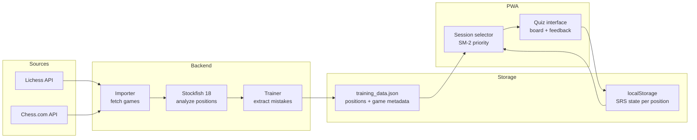
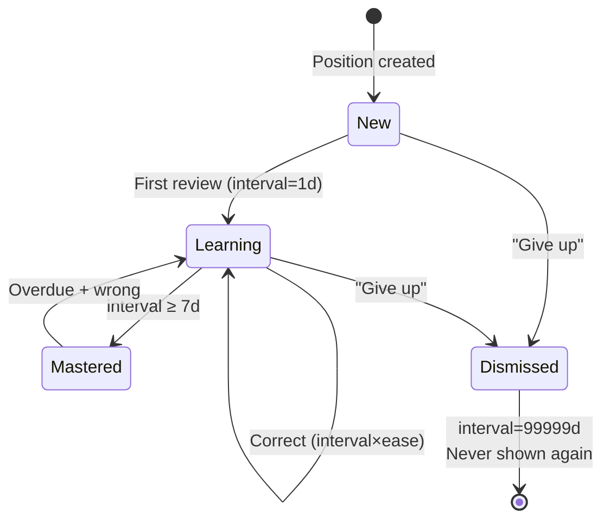

# Data flows

How data moves through the system.

## Data lifecycle

How training data flows from chess platforms to the player's practice sessions.




### training_data.json structure

```
{
  version, generated, player: {lichess, chesscom},
  positions: [
    { id, fen, player_color, player_move, best_move,
      context, score_before, score_after, cp_loss, category,
      explanation, acceptable_moves, pv,
      game: { id, source, opponent, date, result },
      clock: { player, opponent },
      srs: { interval, ease, next_review, history } }
  ],
  analyzed_game_ids: [...]
}
```

### localStorage SRS state

```
train_srs: {
  "<position_id>": {
    interval, ease, repetitions, next_review,
    history: [{ date, correct, dismissed? }]
  }
}
```

---

## SRS (Spaced Repetition) algorithm

The SM-2 variant used for scheduling position reviews.




| Outcome | Effect |
|---------|--------|
| Correct (1st rep) | interval = 1 day |
| Correct (2nd rep) | interval = 3 days |
| Correct (3rd+ rep) | interval = interval × ease |
| Wrong | interval = 1 day, repetitions = 0 |
| Ease adjustment | ease += 0.1 − (5−q)(0.08 + (5−q)×0.02), min 1.3 |
