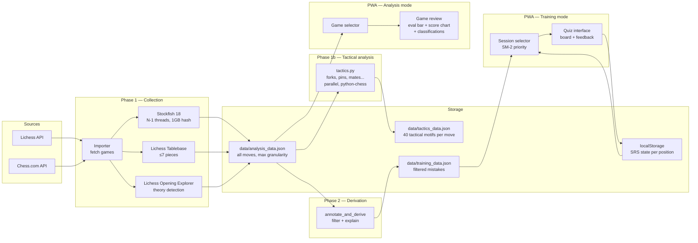
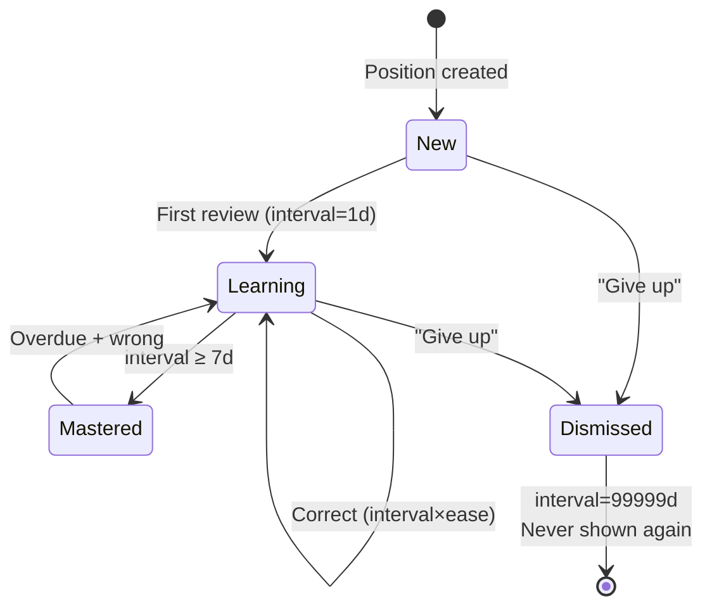

# Data flows

How data moves through the system.

## Data lifecycle

How training data flows from chess platforms to the player's practice sessions.




### Two-layer data model

| File | Content | Used by |
|------|---------|---------|
| `analysis_data.json` | All moves, all evals, per game | Tactical analysis + Phase 2 derivation + Analysis mode |
| `tactics_data.json` | 40 tactical motifs per move (forks, pins, mates...) | Classifier optimization |
| `training_data.json` | Filtered mistakes (unchanged schema) | App + Demo |

Phase 2 can be re-run cheaply without re-running Stockfish (`chess-self-coach train --derive`).

### analysis_data.json structure (per game, per move)

```
{
  version, player,
  games: {
    "<game_url>": {
      headers, player_color, analyzed_at, analysis_duration_s, settings,
      moves: [
        { ply, fen_before, fen_after, move_san, move_uci, side,
          eval_source, in_opening, eval_before: {score_cp, is_mate, depth, seldepth, nodes, nps, time_ms, pv_san, ...},
          eval_after: {...}, eval_after_best: {score_cp, is_mate, mate_in},
          tablebase_before, tablebase_after,
          opening_explorer: {opening: {eco, name}, moves: [{san, white, draws, black}]},
          cp_loss, board: {piece_count, is_check, is_capture, ...},
          clock: {player, opponent, time_spent} }
      ]
    }
  }
}
```

### training_data.json structure (unchanged)

```
{
  version, generated, player: {lichess, chesscom},
  positions: [
    { id, fen, player_color, player_move, best_move,
      context, score_before, score_after, cp_loss, category,
      explanation, acceptable_moves, pv,
      game: { id, source, opponent, date, result },
      clock: { player, opponent },
      srs: { interval, ease, next_review, history } }
  ],
  analyzed_game_ids: [...]
}
```

### localStorage SRS state

```
train_srs: {
  "<position_id>": {
    interval, ease, repetitions, next_review,
    history: [{ date, correct, dismissed? }]
  }
}
```

---

## SRS (Spaced Repetition) algorithm

The SM-2 variant used for scheduling position reviews.




| Outcome | Effect |
|---------|--------|
| Correct (1st rep) | interval = 1 day |
| Correct (2nd rep) | interval = 3 days |
| Correct (3rd+ rep) | interval = interval × ease |
| Wrong | interval = 1 day, repetitions = 0 |
| Ease adjustment | ease += 0.1 − (5−q)(0.08 + (5−q)×0.02), min 1.3 |
