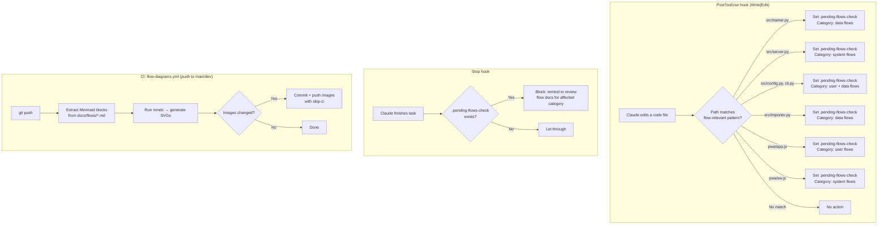

# Meta flows

How this documentation stays up to date.

## Auto-documentation hooks

Claude hooks and CI work together to keep flow documentation synchronized with code changes.

### How it works

1. **PostToolUse hook** (`check-readme-sync.sh`): when Claude edits a file matching flow-relevant paths, it creates a `.pending-flows-check` marker file. This is separate from the existing `.pending-readme-check` marker.

2. **Stop hook** (`check-flows-on-stop.sh`): when Claude finishes a task, it checks for the marker. If present, it blocks with a reminder listing which flow category to review.

3. **CI workflow** (`flow-diagrams.yml`): on every push to `main` or `dev`, extracts Mermaid blocks from `docs/flows/*.md`, runs `mmdc` (Mermaid CLI) to generate SVG images, and commits them back if changed.

### Flow-relevant path mapping

| Source file | Flow category |
|------------|---------------|
| `src/chess_self_coach/trainer.py` | [Data flows](data-flows.md) |
| `src/chess_self_coach/server.py` | [System flows](system-flows.md) |
| `src/chess_self_coach/config.py` | [Data flows](data-flows.md) |
| `src/chess_self_coach/cli.py` | [User flows](user-flows.md) |
| `src/chess_self_coach/importer.py` | [Data flows](data-flows.md) |
| `pwa/app.js` | [User flows](user-flows.md) |
| `pwa/sw.js` | [System flows](system-flows.md) |
