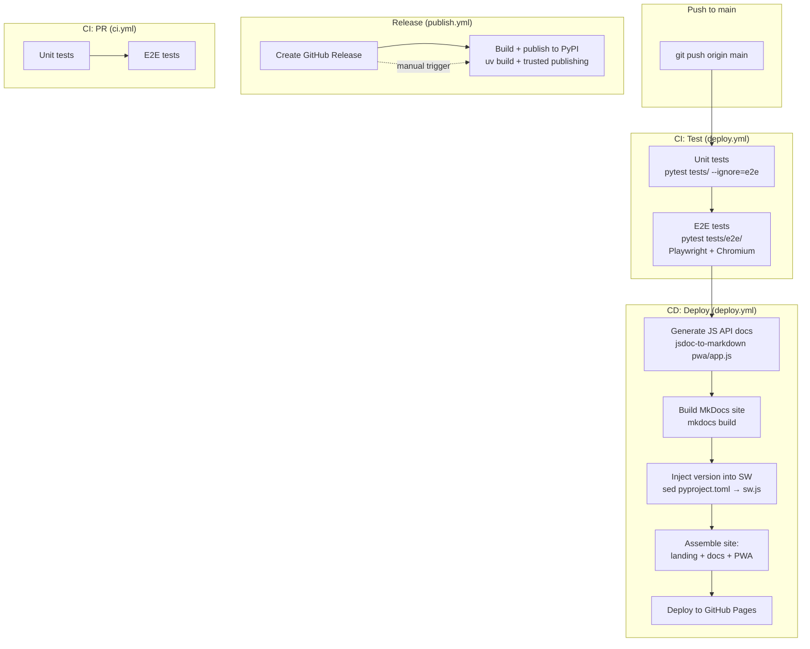
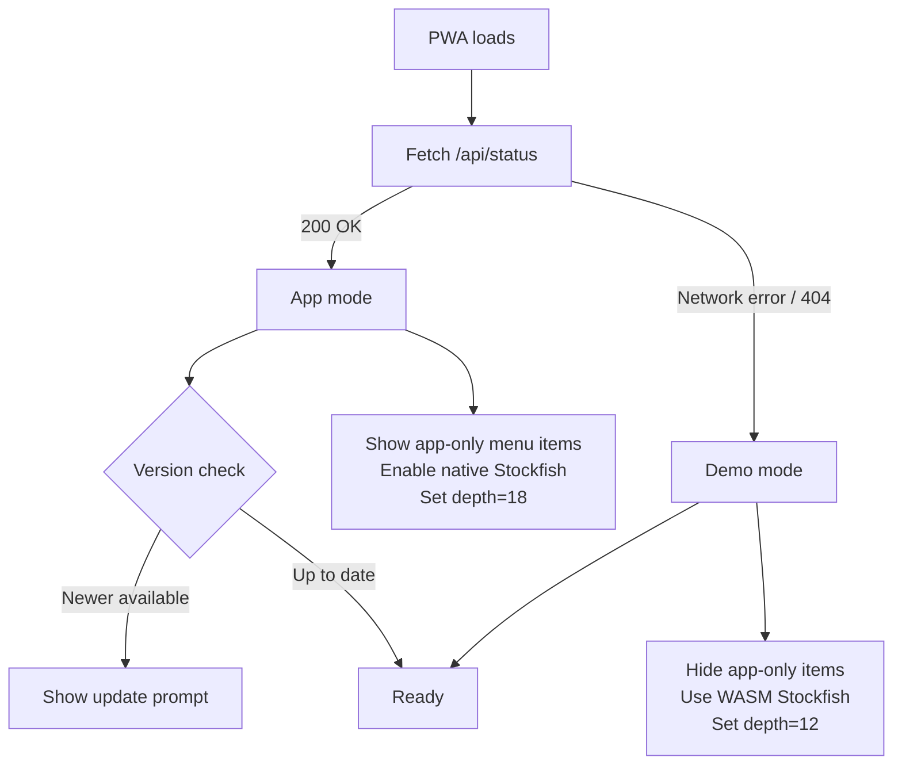
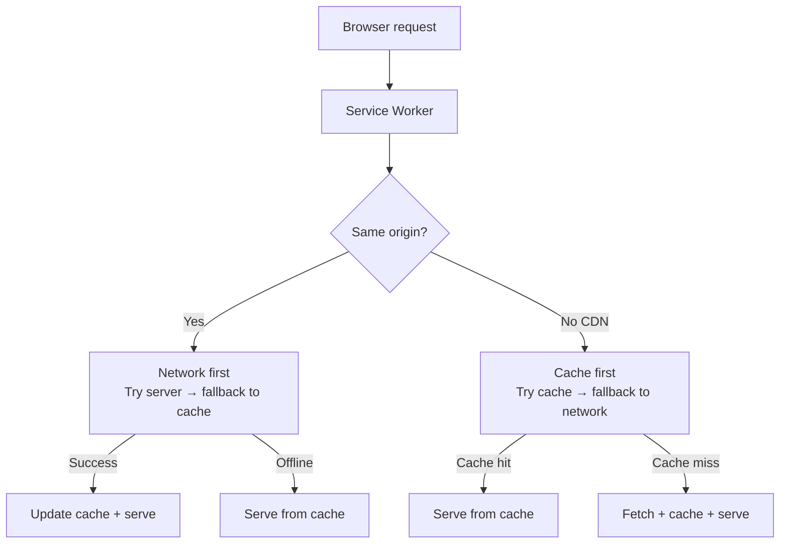

# System flows

Infrastructure and runtime internals.

## CI/CD pipeline

What happens when code is pushed.




### GitHub Pages site structure

```
site/
├── index.html          ← Landing page
├── docs/               ← MkDocs output (this documentation)
│   ├── index.html
│   ├── setup/
│   ├── cli/
│   ├── training/
│   ├── flows/
│   └── api/
└── train/              ← PWA (demo mode)
    ├── index.html
    ├── app.js
    ├── style.css
    ├── sw.js
    ├── manifest.json
    ├── training_data.json
    └── stockfish/
```

---

## PWA mode detection

How the app decides whether it's running as a demo or as an installed application.




---

## Service worker & caching

How the PWA handles offline access and updates.




### Key rules

- **Network-first** for same-origin assets: always serve fresh files from the server (important because `server.py` serves files dynamically).
- **Cache-first** for CDN resources (chessground, chess.js): these never change.
- `skipWaiting()` + `clients.claim()` ensure the new SW takes over immediately.

---

## Stockfish lifecycle

How Stockfish is detected, managed, and recovered across CLI, server, and PWA.


```mermaid
flowchart TD
    subgraph "CLI / Server: Native Stockfish"
        FIND[find_stockfish] --> S1{Config path?}
        S1 -->|exists| S_OK[Use config path]
        S1 -->|missing| S2{Fallback path?}
        S2 -->|exists| S_OK
        S2 -->|missing| S3{En-Croissant default?}
        S3 -->|exists| S_OK
        S3 -->|missing| S4{/usr/games/stockfish?}
        S4 -->|exists| S_OK
        S4 -->|missing| S5{which stockfish?}
        S5 -->|found| S_OK
        S5 -->|not found| S_ERR[Error: tested paths + install hint]

        S_OK --> VER_CHK[check_stockfish_version]
        VER_CHK --> VER_OK{Matches expected?}
        VER_OK -->|No| VER_WARN[Warning: version mismatch]
        VER_OK -->|Yes| READY_N[Engine ready]
        VER_WARN --> READY_N
    end

    subgraph "Server: Crash recovery"
        READY_N --> REQ_S[/api/stockfish/bestmove]
        REQ_S --> LOCK[Acquire engine lock]
        LOCK --> PLAY[engine.play]
        PLAY -->|EngineTerminatedError| RESTART[Restart engine]
        RESTART --> PLAY
        PLAY -->|Success| RESP[Return best move]
    end

    subgraph "PWA: WASM Stockfish"
        INIT[initStockfish] --> WORKER[new Worker<br/>stockfish-18-lite-single.js]
        WORKER --> UCI[Send: uci + isready]
        UCI --> READY_W[Engine ready]
        READY_W --> BM[getBestMove fen depth=12]
        BM --> POST_MSG[postMessage: position + go]
        POST_MSG --> PARSE[Parse bestmove from output]
    end
```

### Key details

- **Search order**: config path → fallback path → En-Croissant → `/usr/games/stockfish` → `$PATH`.
- **Server crash recovery**: catches `EngineTerminatedError`, restarts engine, retries the request.
- **Engine lock**: `asyncio.Lock` prevents concurrent access to the single engine process.
- **WASM variant**: uses `stockfish-18-lite-single.js` (single-threaded, suitable for browser). Depth limited to 12 (vs 18 for native).
- **Lazy init**: WASM worker is only created on first call to `getBestMove()`.
