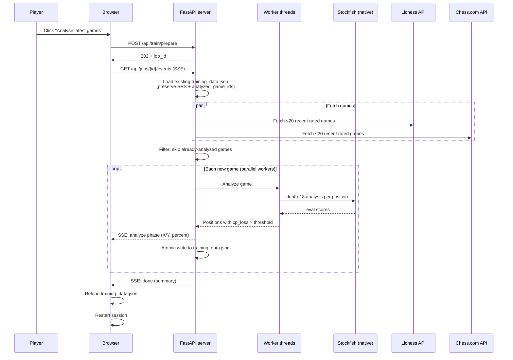
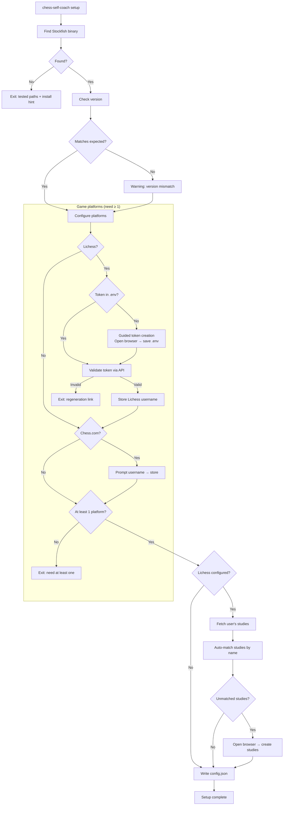
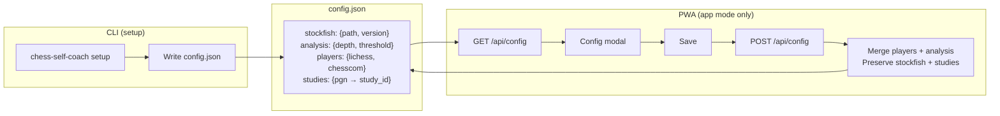

# User flows

Interactive workflows visible to the player.

## Training session (PWA)

The core user-facing flow: the player practices positions extracted from their own games.

### Key details

- **Position selection** uses SM-2 spaced repetition: overdue positions first, then new (blunders prioritized), then learning (interval < 7 days). Mastered positions are skipped.
- **Intra-session repetition**: a correct first attempt reinserts the position 5 slots later for confirmation. A wrong answer reinserts 3 slots later.
- **Dismiss** ("Give up on this lesson") sets interval to 99999 days — the position never appears again.
- **SRS state** is stored per position ID in `localStorage` key `train_srs`.

---

## Analyse latest games (app mode)

Fetches recent games, runs Stockfish analysis, and generates training positions.

### Key details

- **Incremental merge**: only new games are analyzed. Existing positions keep their SRS state.
- **Thresholds**: blunder ≥ 200cp, mistake ≥ 100cp, inaccuracy ≥ 50cp.
- **Parallelism**: N-1 CPU cores (ProcessPoolExecutor).
- **Crash safety**: atomic write after each game — if interrupted, partial results are saved.
- **Interrupt**: user can click the interrupt button → `POST /api/jobs/{id}/cancel` → saves progress so far.
- **Hardcoded defaults** (v0.3.8): 20 games per source, depth 18, no UI to customize.

---

## Setup wizard (CLI)

Interactive CLI flow that configures the application for first use.

### Key details

- **Stockfish search order**: config path → fallback path → En-Croissant default → `/usr/games/stockfish` → `$PATH`.
- **Token validation**: must start with `lip_` prefix, verified against Lichess API.
- **Study mapping**: auto-matches local PGN filenames against Lichess study names (case-insensitive substring).
- **Idempotent**: re-running setup merges with existing config (preserves studies, updates players/analysis).

---

## Config management

How configuration is created via CLI and edited via PWA.

### Key details

- **CLI creates** the full config: stockfish, analysis, players, studies.
- **PWA edits** only `players` and `analysis` fields (stockfish and studies are CLI-managed).
- **Merge strategy**: server loads full config, overwrites only the editable fields, writes back.
- **Format**: JSON with 2-space indent, `ensure_ascii=False`.
