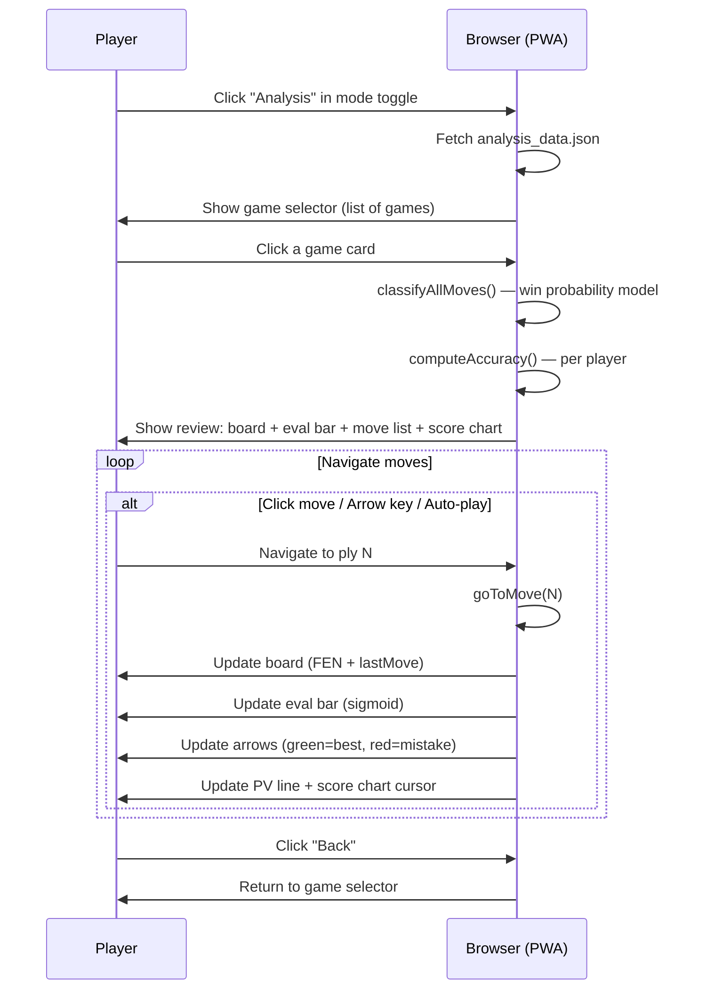
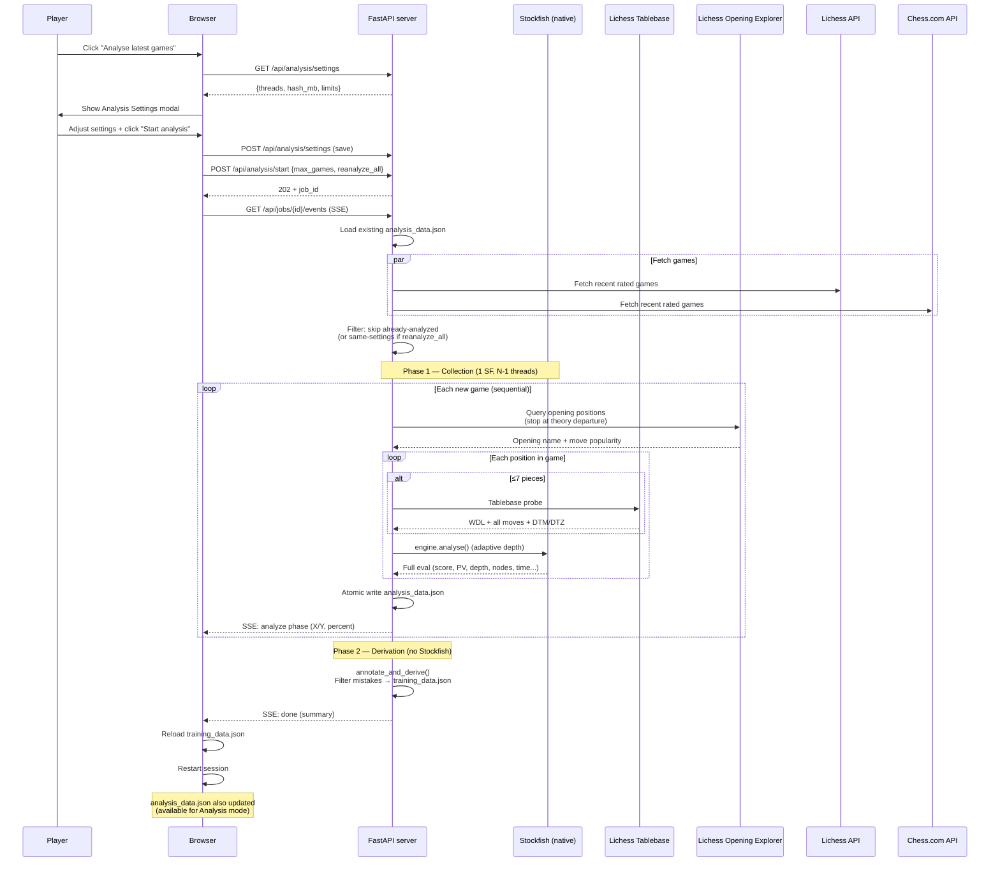
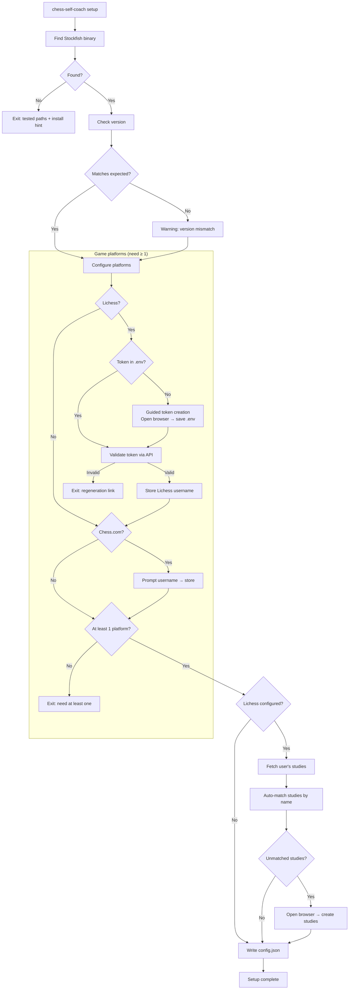
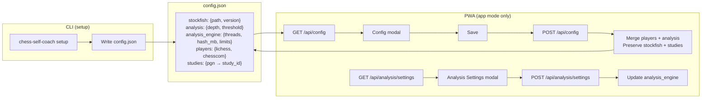

# User flows

Interactive workflows visible to the player.

## Training session (PWA)

The core user-facing flow: the player practices positions extracted from their own games.

### Key details

- **Position selection** uses SM-2 spaced repetition: overdue positions first, then new (blunders prioritized), then learning (interval < 7 days). Mastered positions are skipped.
- **Intra-session repetition**: a correct first attempt reinserts the position 5 slots later for confirmation. A wrong answer reinserts 3 slots later.
- **Dismiss** ("Give up on this lesson") sets interval to 99999 days — the position never appears again.
- **SRS state** is stored per position ID in `localStorage` key `train_srs`.

---

## Game review (Analysis mode, PWA)

The player reviews full games move-by-move with eval visualization. Available in both [demo] and [app] modes.

### Key details

- **Mode toggle**: segmented control `[Training | Analysis]` in the header.
- **Game selector**: cards showing opponent, date, result (W/D/L badge), opening name, move count.
- **Move classifications**: win probability model — `winProb(cp) = 1/(1+10^(-cp/400))`, thresholds: Best ≤0, Excellent ≤0.02, Good ≤0.05, Inaccuracy ≤0.10, Mistake ≤0.20, Blunder >0.20.
- **Eval bar**: sigmoid mapping, 50% at equal, smooth CSS transition. Shows "Book" for opening moves, "M3" for mate.
- **Score chart**: Canvas, click to jump to any move, colored dots at mistakes/blunders.
- **Board arrows**: `reviewCg.set({drawable: {autoShapes: [...]}})` — green for best move, red for played mistake.
- **Keyboard**: ArrowLeft/Right, Home/End. Active only in analysis view.
- **Flip board**: toggles `reviewOrientation` on the second Chessground instance.

---

## Analyse latest games (app mode)

Fetches recent games, runs full analysis (Stockfish + APIs), and generates training positions.

### Key details

- **Settings modal**: before analysis starts, user configures threads, hash, depth/time limits, and number of games.
- **Two-phase pipeline**: Phase 1 collects raw data (expensive), Phase 2 derives training data (cheap, re-runnable via `POST /api/train/derive`).
- **Engine model**: one Stockfish with N-1 threads + 1GB hash (configurable), sequential game-by-game.
- **Opening Explorer**: queries Lichess API position by position until theory departure (move not in database).
- **Incremental**: only unanalyzed games are processed. `reanalyze_all` skips only same-settings games.
- **Crash safety**: atomic write of `analysis_data.json` after each game. Resumable on interruption.
- **Thresholds**: blunder ≥ 200cp, mistake ≥ 100cp, inaccuracy ≥ 50cp.
- **Interrupt**: user can click interrupt → `POST /api/jobs/{id}/cancel` → saves progress so far.

---

## Setup wizard (CLI)

Interactive CLI flow that configures the application for first use.

### Key details

- **Stockfish search order**: config path → fallback path → En-Croissant default → `/usr/games/stockfish` → `$PATH`.
- **Token validation**: must start with `lip_` prefix, verified against Lichess API.
- **Study mapping**: auto-matches local PGN filenames against Lichess study names (case-insensitive substring).
- **Idempotent**: re-running setup merges with existing config (preserves studies, updates players/analysis).

---

## Config management

How configuration is created via CLI and edited via PWA.

### Key details

- **CLI creates** the full config: stockfish, analysis, players, studies.
- **PWA edits** only `players` and `analysis` fields (stockfish and studies are CLI-managed).
- **Merge strategy**: server loads full config, overwrites only the editable fields, writes back.
- **Format**: JSON with 2-space indent, `ensure_ascii=False`.
