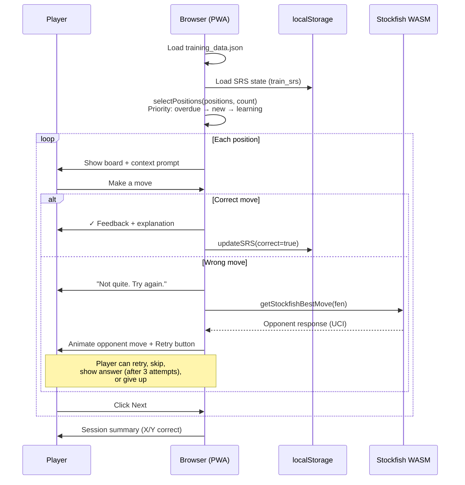
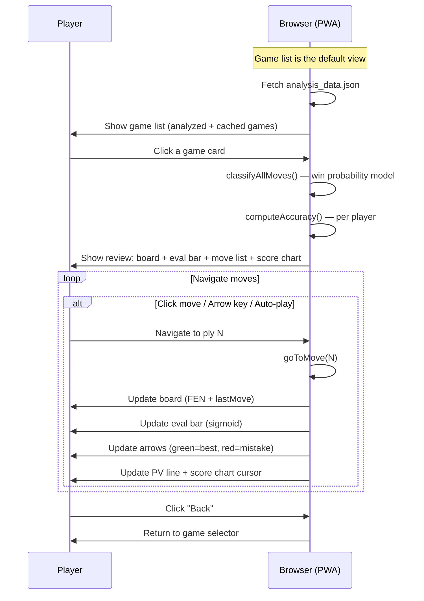
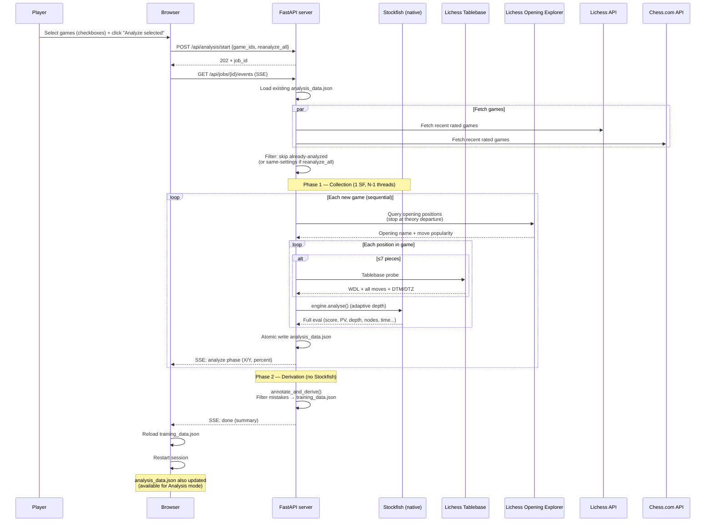
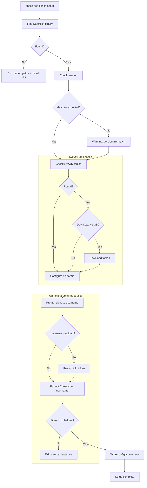
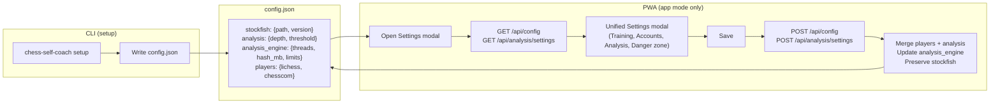

# User flows

Interactive workflows visible to the player.

## Training session (PWA)

The core user-facing flow: the player practices positions extracted from their own games.

### Key details

- **Position selection** uses SM-2 spaced repetition: overdue positions first, then new (blunders prioritized), then learning (interval < 7 days). Mastered positions are skipped.
- **Intra-session repetition**: a correct first attempt reinserts the position 5 slots later for confirmation. A wrong answer reinserts 3 slots later.
- **Skip** reinserts the position 3 slots later without affecting SRS state.
- **Show answer** (after 3 wrong attempts) reveals the correct move with explanation and PV, but records a failure in SRS.
- **Dismiss** ("Give up on this lesson") sets interval to 99999 days — the position never appears again.
- **SRS state** is stored per position ID in `localStorage` key `train_srs`.

---

## Game review (Analysis mode, PWA)

The player reviews full games move-by-move with eval visualization. Available in both [demo] and [app] modes.

### Key details

- **Game list**: default view, shows all games (analyzed + cached). Cards showing opponent, date, result (W/D/L badge), opening name, move count. Analyzed games also show accuracy % and classification badges. All games have checkboxes for (re-)analysis; selecting an already-analyzed game auto-sets `reanalyze_all`. Toolbar filters: result (All/Wins/Losses/Draws), color (All/White/Black), opening (dynamic with counts), status (All/Analyzed/Not analyzed), page size (20/50/100) + pagination.
- **Training**: accessible via hamburger menu → "Training" (all positions) or per-game "Train" button in review.
- **Move classifications**: win probability model — `winProb(cp) = 1/(1+10^(-cp/400))`, thresholds: Brilliant (!!) sacrifice, Great (!) punishment, Best (★) ≤0, Excellent (↑) ≤0.02, Good ≤0.05, Inaccuracy (?!) ≤0.10, Mistake (?) ≤0.20, Blunder (??) >0.20. Brilliant criteria: piece sacrifice (value >2) + EPL < -0.005 (must improve position) + wpBefore 0.20–0.95 + not opening theory + PV ≥3 moves. Great criteria: EPL ≤0.02 + opponent's previous move lost ≥15% wp + player's EPL ≤0 (maintains/improves) + not a recapture on same square + not opening. Miss criteria: opponent's previous move lost ≥15% wp + best move was a capture winning net material in ≤4 exchanges + player's EPL >0.05 (failed to capitalize) + not opening.
- **Eval bar**: sigmoid mapping, 50% at equal, smooth CSS transition. For book moves (no Stockfish eval), derives approximate cp from opening explorer win/draw/loss stats. Shows "M3" for mate.
- **Score chart**: Canvas, click to jump to any move, colored dots at brilliant/mistakes/blunders.
- **Board arrows**: `reviewCg.set({drawable: {autoShapes: [...]}})` — green for best move, red for played mistake.
- **Keyboard**: ArrowLeft/Right, Home/End. Active only in analysis view.
- **Flip board**: toggles `reviewOrientation` on the second Chessground instance.

---

## Analyze selected games (app mode)

User selects games from the game list, triggers Stockfish analysis on selected games, and generates training positions.

### Key details

- **Settings modal**: unified modal with Training, Accounts, Analysis (presets: Quick/Balanced/Deep + Advanced toggle), and Danger zone sections.
- **Two-phase pipeline, per-game**: Phase 1 collects raw data (expensive), Phase 2 derives training data (cheap). Phase 2 runs after **each game** (not at end of batch), so accuracy badges, review, and training are available immediately.
- **Engine model**: one Stockfish with N-1 threads + 1GB hash (configurable), sequential game-by-game.
- **Opening Explorer**: queries Lichess API position by position until theory departure (move not in database).
- **Incremental**: only unanalyzed games are processed. `reanalyze_all` skips only same-settings games.
- **Crash safety**: atomic write of `analysis_data.json` after each game. Resumable on interruption.
- **Thresholds**: blunder ≥ 200cp, mistake ≥ 100cp, inaccuracy ≥ 50cp.
- **Interrupt**: user can click interrupt → `POST /api/jobs/{id}/cancel` → saves progress so far.
- **Batch queuing**: selecting more games while a job runs queues them for the next batch. On 409 (job running), PWA reconnects to SSE via `GET /api/jobs/current`.
- **Fetch games**: menu → "Fetch games" opens modal with "Fetch latest" (200 recent) or "Fetch N games" (configurable count, includes older games). Backend: `POST /api/games/fetch?max_games=N`.

---

## Setup wizard (CLI)

Interactive CLI flow that configures the application for first use.

### Key details

- **Stockfish search order**: config path → fallback path → En-Croissant default → `/usr/games/stockfish` → `$PATH`.
- **Token handling**: prompted via CLI input, saved to `.env` file. No API validation during setup.
- **Idempotent**: re-running setup merges with existing config (updates players/analysis).

---

## Config management

How configuration is created via CLI and edited via PWA.

### Key details

- **CLI creates** the full config: stockfish, analysis, players.
- **PWA edits** only `players` and `analysis` fields (stockfish is CLI-managed).
- **Merge strategy**: server loads full config, overwrites only the editable fields, writes back.
- **Format**: JSON with 2-space indent, `ensure_ascii=False`.
